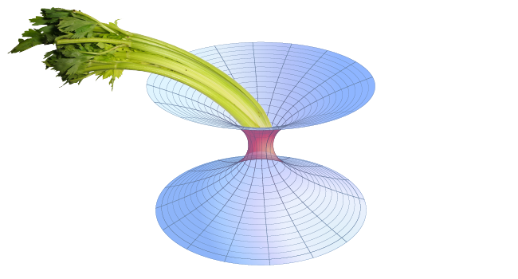

# GWCelery

Hipster pipeline for annotating LIGO events.

## Features

 - Easy installation with `pip`
 - Lightning fast distributed task queue powered by
   [Celery](http://celeryproject.org) and Redis (https://redis.io)
 - Tasks are defined by [small, self-contained Python functions](https://git.ligo.org/emfollow/gwcelery/tree/master/gwcelery/tasks)
 - [Lightweight test suite](https://git.ligo.org/emfollow/gwcelery/tree/master/gwcelery/tests) using mocks of external services
 - [Continuous integration](https://git.ligo.org/emfollow/gwcelery/pipelines)
 - [One line of code to switch from test to production GraceDB server](https://git.ligo.org/emfollow/gwcelery/blob/master/gwcelery/celery.py)
 - Browser-based monitoring console (see below)

## Instructions

### To install

With `pip`:

	$ pip install --user git+https://git.ligo.org/emfollow/gwcelery

### To test

With `setup.py`:

	$ python setup.py test

### To start

**NOTE** that GWCelery requires [redis](https://redis.io). Your package manager
(apt, yum, macports) should be able to install, configure, and automatically
launch a suitable redis server, but otherwise you can use the
[Redis Quick Start](https://redis.io/topics/quickstart) instructions to build
redis and start a server:

	$ wget http://download.redis.io/redis-stable.tar.gz
	$ tar xvzf redis-stable.tar.gz
	$ cd redis-stable
	$ make -j
	$ src/redis-server

GWCelery itself consists of three workers:

	$ gwcelery worker -Q celery -n gwcelery-worker -B -l info
	$ gwcelery worker -c 1 -Q openmp -n gwcelery-openmp-worker -l info
	$ gwcelery worker -c 1 -Q voevent -n gwcelery-voevent-worker -l info

### To monitor in a browser

GWCelery supports [Flower](https://flower.readthedocs.io/) for in-browser
monitoring. To start Flower for monitoring during local development, run the
following command and then navigate to `http://localhost:5555/` in your browser:

	$ gwcelery flower

To set up monitoring on a LIGO Data Grid cluster machine (e.g.
`emfollow.ligo.caltech.edu`) protected by LIGO.org authentication, start Flower
using the following command:

	$ gwcelery flower --url-prefix=~${USER}/gwcelery

add the following lines to the file `~/public_html/.htaccess`:

	RewriteEngine on
	RewriteRule ^gwcelery/?(.*)$ http://emfollow.ligo.caltech.edu:5555/$1 [P]

Some additional firewall configuration may be required.

### Recommended procedure for starting and stopping with HTCondor

The recommended way to start and stop GWCelery on the LIGO Data Grid cluster is
using [HTCondor](https://research.cs.wisc.edu/htcondor/). See the example
HTCondor submit file [`etc/gwcelery.sub`](etc/gwcelery.sub). This submit file
will start up Redis, the three worker processes, and Flower. To start, go into
the `etc/` directory in the source tree and run `condor_submit` as follows:

	$ condor_submit gwcelery.sub
	Submitting job(s).....
	5 job(s) submitted to cluster 293497.

Make note of the cluster number on the last line. To stop GWCelery, run the
`condor_hold` command:

	$ condor_hold 293497
	All jobs in cluster 293497 have been held

To restart GWCelery, run `condor_release`:

	$ condor_release 293497
	All jobs in cluster 293497 have been released

Note that there is normally **no need** to explicitly kill or re-submit
GWCelery if the machine is rebooted, because the jobs will persist in the
HTCondor queue.
