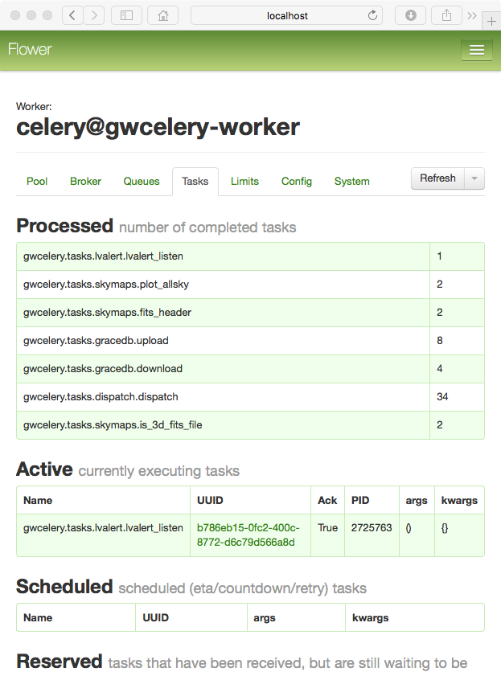

# Monitoring in a browser

GWCelery supports [Flower](https://flower.readthedocs.io/) for in-browser
monitoring. To start Flower for monitoring during local development, run the
following command and then navigate to `http://localhost:5555/` in your browser:

	$ gwcelery flower

To set up monitoring on a LIGO Data Grid cluster machine (e.g.
`emfollow.ligo.caltech.edu`) protected by LIGO.org authentication, start Flower
using the following command:

	$ gwcelery flower --url-prefix=~${USER}/gwcelery

add the following lines to the file `~/public_html/.htaccess`:

	RewriteEngine on
	RewriteRule ^gwcelery/?(.*)$ http://emfollow.ligo.caltech.edu:5555/$1 [P]

Some additional firewall configuration may be required.

