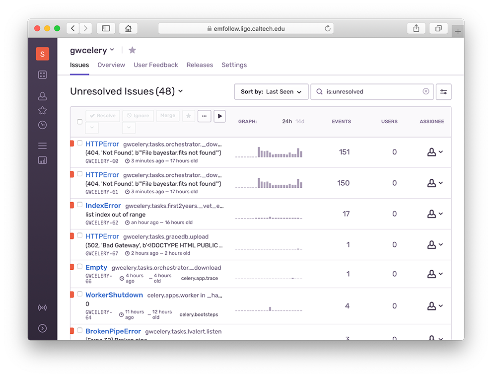

.. highlight:: shell-session

Monitoring and Management
=========================

GWCelery supports a rich selection of management and monitoring tools. Here is
an introduction to a few of them. For more Celery monitoring solutions, see the
:doc:`Celery monitoring and management guide <celery:userguide/monitoring>`.

Flower
------

Flower_ is a dashboard for monitoring Celery tasks. To start Flower for
monitoring during local development, run the following command and then
navigate to http://localhost:5555/ in your browser::

    $ gwcelery flower

Sentry
------

All warnings, errors, exceptions, and tasks failures are both logged to disk
and uploaded instantly to Sentry_, an error monitoring and reporting platform.
The Sentry instance is installed `on premise`_ at Caltech. Sentry notifies
GWCelery contributors by email when a new bug occurs.

For details about the Sentry logging configuration, see the
:mod:`gwcelery.sentry` module or the `Celery integration module`_ in the Sentry
SDK docs.

Flask
-----

GWCelery includes a Flask_ web application that provides forms to manually
initiate certain tasks.
    
To start Flask for monitoring during local development, run the following
command and then navigate to http://localhost:5000/ in your browser::

    $ gwcelery flask run

Nagios
------

.. note::
   The GWCelery Nagios plugin is tailored to GWCelery and is not sufficiently
   general to use with other Celery applications.

The dashboard.ligo.org_ and monitor.ligo.org_ services use Nagios_ to monitor
and report on the health of all of the components of the low-latency analysis
infrastructure.

GWCelery provides the command ``gwcelery nagios`` to check the status of the
application and provide a report in `the format that Nagios expects`_.

You can run it manually from the command line::

    $ gwcelery nagios
    OK: GWCelery is running normally

To configure Nagios itself, see the `Nagios configuration overview`_, or if
GWCelery and Nagios are running on different hosts, the `Nagios Remote Plugin
Executor (NRPE) documentation`_.

Command-Line Tools
------------------

All Celery application provide :ref:`command-line monitoring and management
utilities <celery:monitoring-control>`, including the following:

*   ``gwcelery shell``: Start an interactive Python or IPython interpreter for
    interacting with Celery. All tasks as well as the :obj:`~gwcelery.app`
    application instance are automatically imported and available as globals.
    Example::

        $ gwcelery shell
        Python 3.6.6 (default, Jun 28 2018, 05:43:53)
        Type 'copyright', 'credits' or 'license' for more information
        IPython 6.5.0 -- An enhanced Interactive Python. Type '?' for help.

        In [1]: download.s('coinc.xml', 'M6757').delay().get()

*   ``gwcelery call``: Call a task from the command line by passing it arguments
    in JSON format. The output is the unique identifier of the result.
    Example::

        $ gwcelery call gwcelery.tasks.gracedb.download --args='["coinc.xml", "M6757"]'
        d11099e7-75e5-4aa3-800b-b122b667757c

*   ``gwcelery result``: Get the result of a previously called task. Example::

        $ gwcelery result ab4aa6d7-9f21-420c-8401-cbe6863cf7dc
        (b'<?xml version=\'1.0\' encoding=\'utf-8\'?>\n<!DOCTYPE LIGO_LW SYSTEM "htt'
         b'p://ldas-sw.ligo.caltech.edu/doc/ligolwAPI/html/ligolw_dtd.txt">\n<LIGO_L'
         ...
         b'\t</Stream>\n\t</Table>\n</LIGO_LW>\n')

*   ``gwcelery events``: A text UI monitoring tool that offers functionality
    similar to Flower. Example::

        $ gwcelery events

    .. image:: _static/celeryevent-screenshot.png
       :alt: Screenshot of celeryevent text UI monitor

.. _Flower: https://flower.readthedocs.io/
.. _dashboard.ligo.org: https://dashboard.ligo.org/
.. _monitor.ligo.org: https://monitor.ligo.org/
.. _Nagios: https://www.nagios.com
.. _the format that Nagios expects: https://assets.nagios.com/downloads/nagioscore/docs/nagioscore/3/en/pluginapi.html
.. _Nagios configuration overview: https://assets.nagios.com/downloads/nagioscore/docs/nagioscore/4/en/config.html
.. _Nagios Remote Plugin Executor (NRPE) documentation: https://assets.nagios.com/downloads/nagioscore/docs/nrpe/NRPE.pdf
.. _Sentry: https://sentry.io/
.. _`on premise`: https://docs.sentry.io/server/
.. _`Celery integration module`: https://docs.sentry.io/platforms/python/celery/
